# Tire Web Shop

[View the live project here.](https://project4web.onrender.com/)

Tire Webshop is a web application built with Django, allowing users to browse, search, and purchase tires and rims online. It provides a user-friendly interface for customers to explore various tire options, view detailed product information, and add items to their shopping cart.

This is an ongoing project and not a finished result. Future updates will come.

## Features

- Product Listing: Display a wide range of tire and rim products with their  details, including title, description, price, and an accompanying image.

- Search: Allow users to search for specific tire or rim products using keywords or filters to find the desired items quickly.

- Shopping Cart: Enable customers to add products to their shopping cart, review the cart contents, and proceed to checkout for purchase.

- User Authentication: Provide user registration and login functionality to manage personal information and track order history.

- Responsive Design: Ensure the webshop is accessible and optimized for various devices, including desktops, tablets, and mobile phones.

## User Experience (UX)

### Project Goals:
The primary goal for this project is to create a tire webshop, aiming to sell tires and rims here in scandinavia.

### Strategy:
An Agile methodology was used to plan this project. This was implemented using a board in GitHub Project. To cover the goals of this project, a total of 8 user stories was created. 

The following labels were used in this project and the distribution of user stories by label are:

  - Must-Have: 3/6
  - Should-Have: 2/6
  - Could-Have: 1/6

For more information: [View the Kanban Board here.](https://github.com/mittnamnkenny/fishtales/projects/1).

## User Stories

- As a *Site User* I can *register my payment details* so that *I can finalize my purchase*

- As a *Site User* I can *create an account on the site* so that *I can see and save my order history for future purchases*

- As a *Site User* I can *see my shopping cart and the calculated total price of my items* so that *I can see what the total cost of the purchase* 

- As a *Site User* I can *search for products on the site* so that *I can find items fast and easily*

- As a *Site User* I can *add items to the shopping cart * so that *I can collect the products I intend to buy in one place before my purchase*

- As a *Site Admin* I can *add, edit and delete product listings* so that *site users have access to the latest products and product information*

## Existing Features

#### Navbar:

The navbar contains log in, register , cart & call. Also it shows if your are logged in or not. If you are not logged in it will show "Welcome, guest" and if you are logged in "Welcome, (name)" it is also used for navigating between categories and a search function, to search for products.

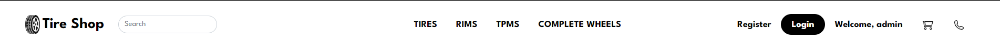

#### Landing page:

Index.html is the landing page and showing some tires as products.

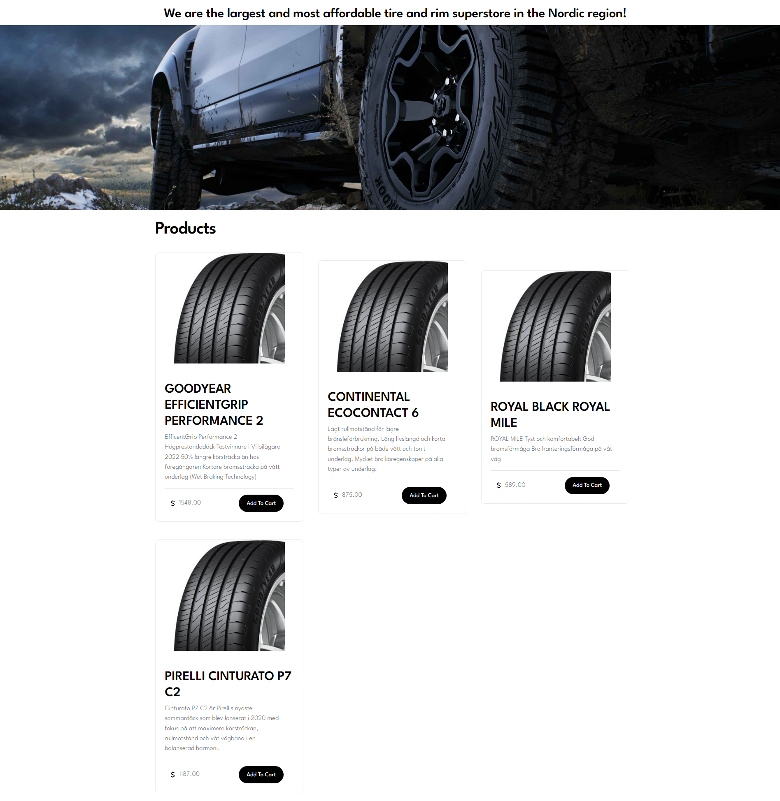

#### Footer

Footer section contains copywright privacy policy and terms

#### Register Page

Register page is where you register as an user. You have to provide:
- First Name
- Last Name
- Username
- Email
- Password

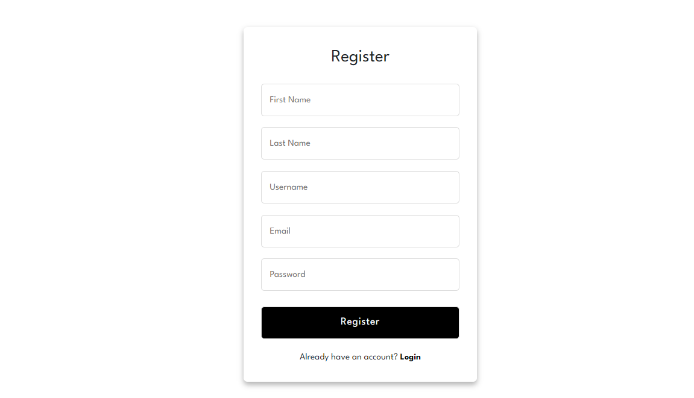

#### log In Page

You have to log in to buy on the page. Log in contains Username field and password field.

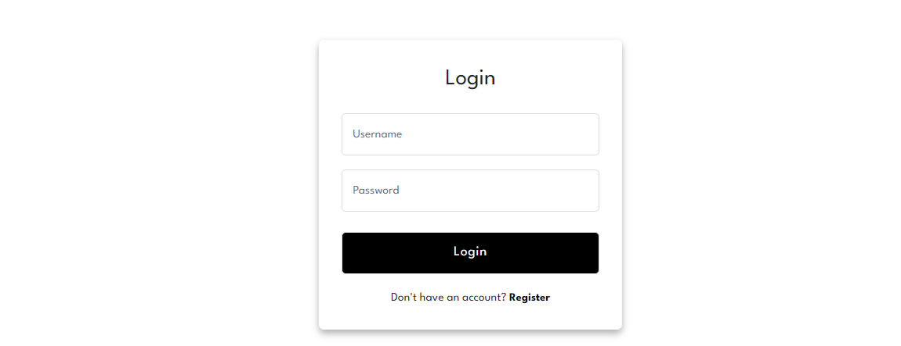

#### Tire page

Here is where you can find the tires. Implemenation is yet to be updated due to size of the tires the coustomor wants. Here is is filtered to only show tires.

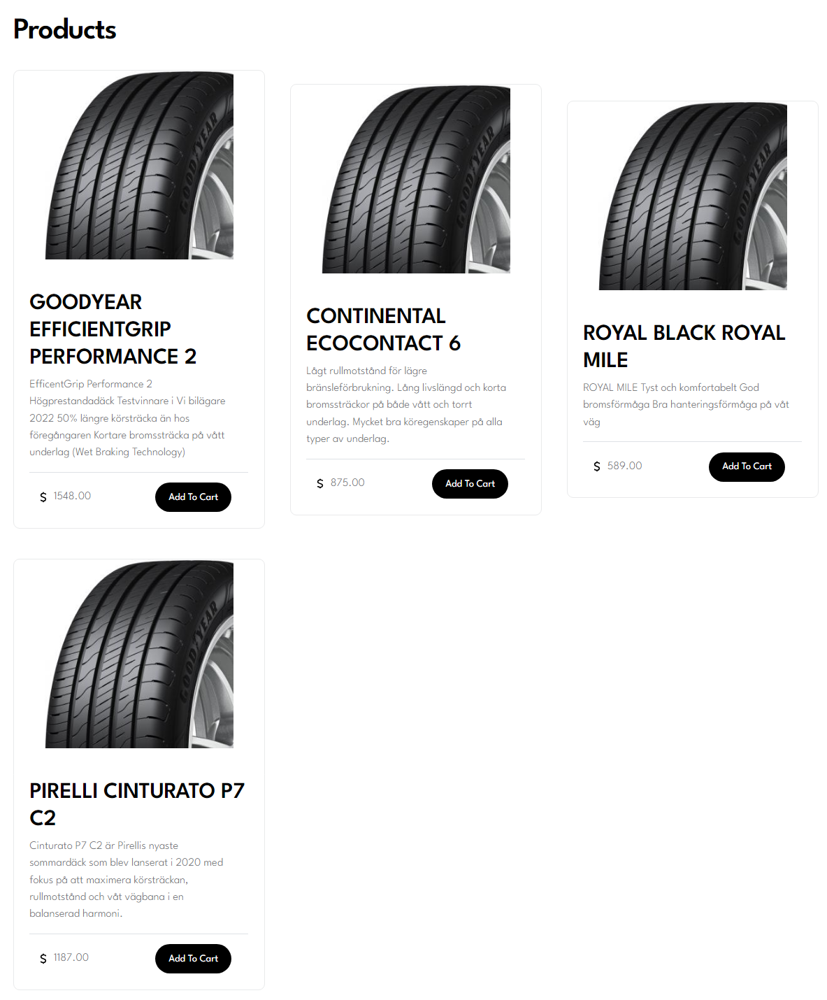

#### Admin page

Here is where you as an admin can create user and create products. Products can be filtered by using category "Tires" and "Rims".

## Design

### Wireframe

### Colours

Color theme is influenced by tires. Black, white and grey is the theme of this project.

### Typography

To make it stand out i used Roboto as a font all throw the project with a backup with Sans-sarif.

## Testing

### Browser Testing

I have tested that this application works using Windows and MacOs. I Used the following browsers for testing:

  - Safari
  - Google Chrome
 

I have tested this application works on the following iOS devices using Safari Version 15.6 browser:

  - iPhone Xs max
  - Poco Phone

### Responsiveness

Chrome developer tool have been used to check the responsiveness.

  - I have tested that this application works on different screen sizes from iPhone 5 (320px wide) and very large screens.

### Validator Testing

#### W3C Markup Validator:

I used W3C HTML validator to validate my html pages, all errors it gives is related to django syntax. Here is the results:

- Base.html

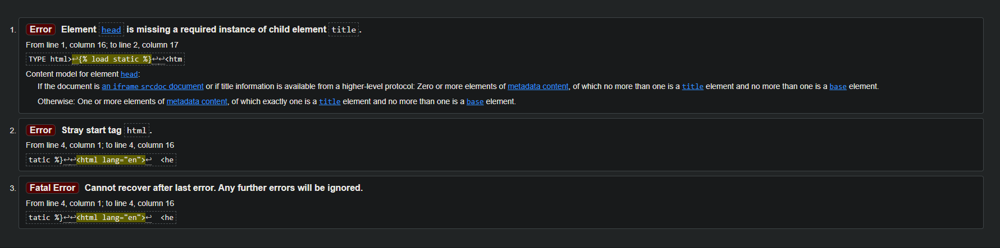

- Index.html

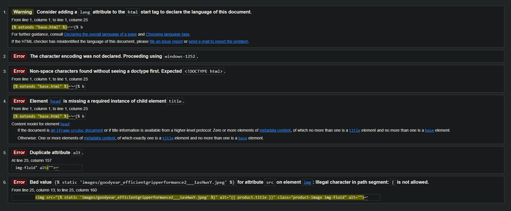

- login.html

- register.html

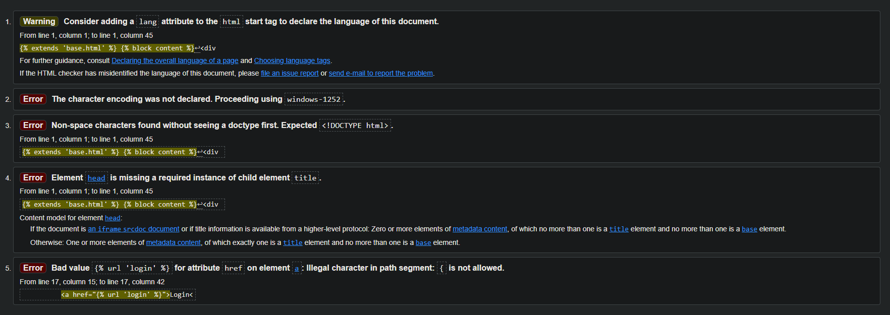

- rims.html

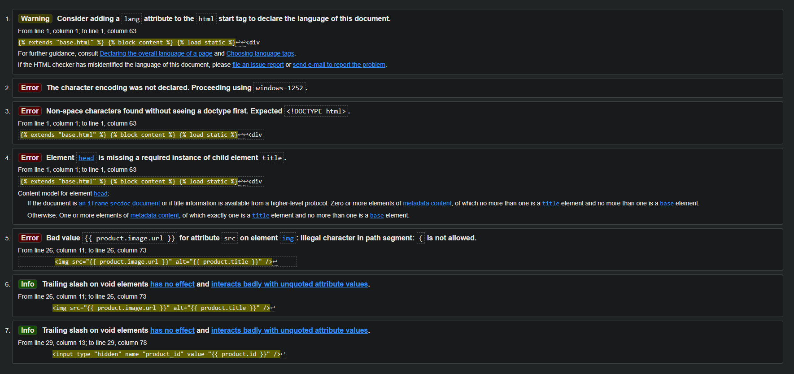

- tires.html

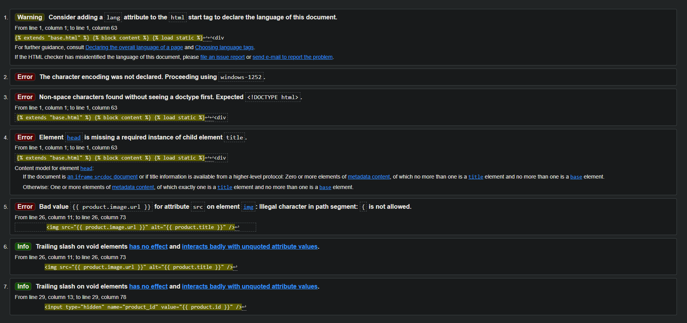

#### W3C CSS Validator:

The CSS jigsaw validator showed no errors, here is the result:

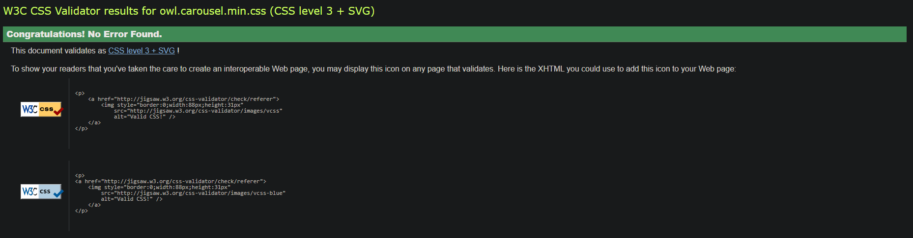

#### JSHint:

The JSHINT validator gives some ES6 warnings for using let, no problems with code. Here is results:

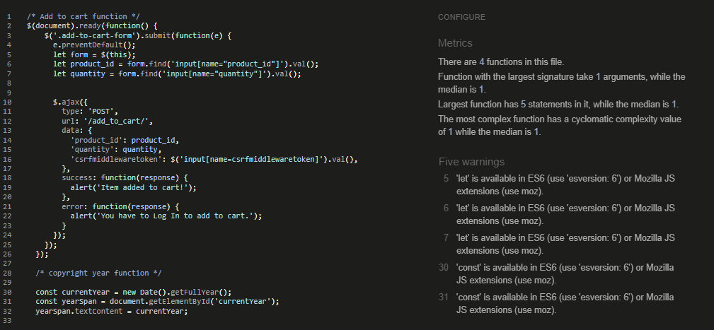

#### PEP8 Online:

The python files was tested in PEP8 validator, here is results from products folder:

- admin.py

- models.py

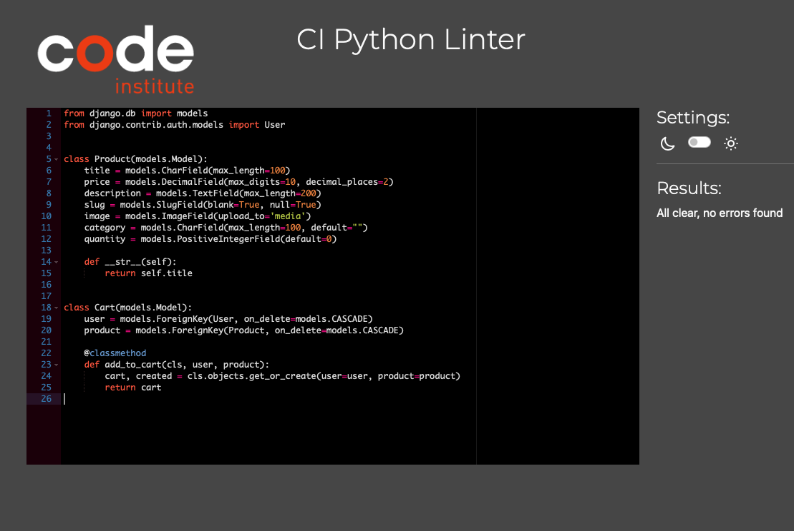

- views.py

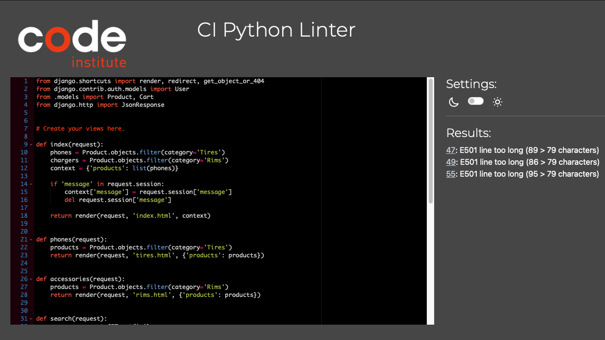

From Register/Login:

- forms.py

- models.py

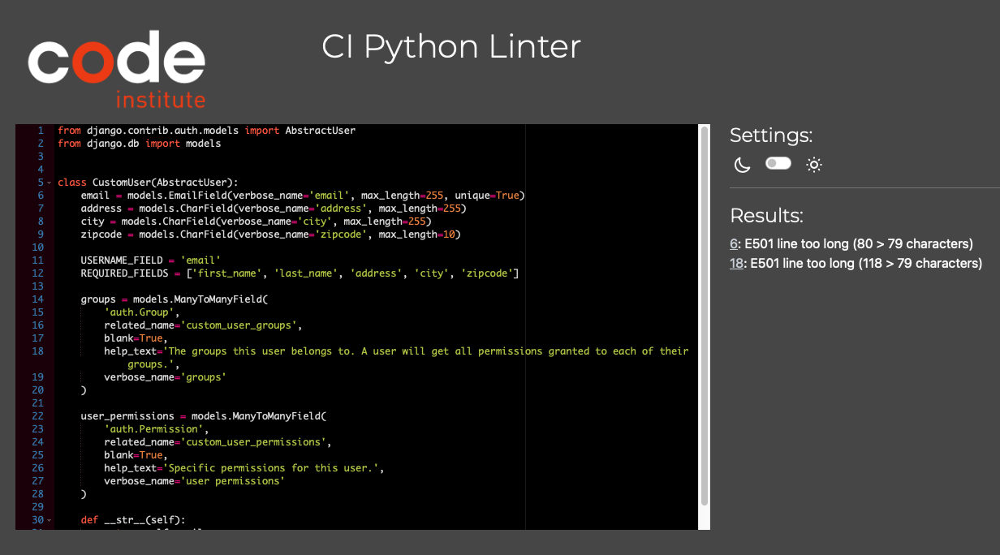

- register_views.py

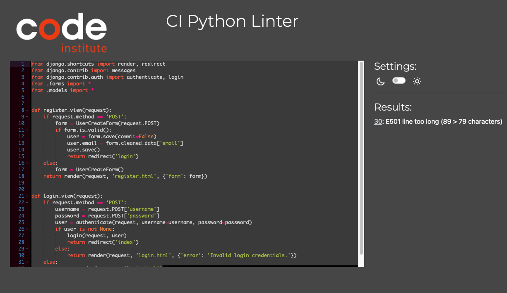

#### Lighthouse:

Here is the results from lighthouse:

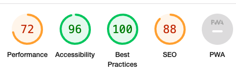

#### Manuel testing:

| ID | Test Label | Test Action | Expected Outcome | Test Outcome |
|----|------------|--------------------------------|--------------|------------------
| 1 | Landing page / Welcome page | User enters site | Images, text, links work | PASS |
| 2 | Menu page | Navigate on menu page | Images, texts, links, icons work | PASS |
| 3 | Register page | User can register  | Works like it should | PASS |
| 4 | Login page | User can register and will be redirected | Works as expected | PASS |
| 5 | Responsiveness | Tested on diffrent device sizes | Works as expected | PASS |
| 6 | Add to cart | User can add to cart when logged in | User can add to cart when user loggs in | PASS |
| 7 | See cart | User can see cart | User can see cart when user is logged in | PASS |
| 8 | Modify cart quantity | User can clear cart but not modify quantity | Works as expected | PASS |

## Deployment
The website will be deployed using the following methods:

### Via Render:

The project is deployed using render.

To Deploy to render you need to:

- Create an account

- Create a server(I use postgres)

- Create a webservice

- Connect it to github and start build

- Remeber to have whitenoise installed for static files

- [LINK TO GITHUB PAGE.](https://oskarj1993.github.io/Project4/)
 

